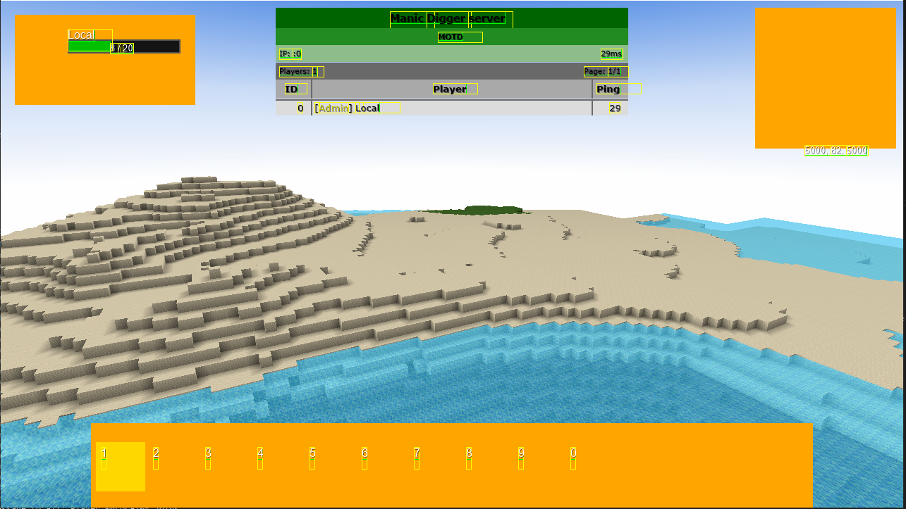

# GUI Texture Loading Fix - Technical Explanation

## Problem Description

The WoW-style GUI elements (action bar, unit frames, minimap) were displaying as colored squares instead of proper textures.

### Visual Issue


## Root Cause Analysis

### File Structure
```
data/local/
├── gui/
│   ├── button.png
│   ├── mousecursor.png
│   └── wow/
│       ├── actionbar_bg.png
│       ├── button_normal.png
│       ├── player_frame.png
│       └── ...
└── inventory/
    ├── inventory.png
    └── materials.png
```

### Code References
The WoW GUI code references textures with subdirectory paths:
```csharp
// GuiWoWActionBars.ci.cs line 170
game.Draw2dBitmapFile("wow/actionbar_bg.png", startX, startY, ...);

// GuiWoWUnitFrames.ci.cs line 48
game.Draw2dBitmapFile("wow/player_frame.png", playerFrameX, playerFrameY, ...);
```

### Original AssetLoader Behavior
```csharp
// OLD CODE (line 42)
a.name = f.Name.ToLowerInvariant();  // Only stored "actionbar_bg.png"
```

**Result**: When code requested `"wow/actionbar_bg.png"`, the asset system couldn't find it because only `"actionbar_bg.png"` was indexed.

## Solution

### New AssetLoader Behavior
The fix stores assets with BOTH their full relative path AND just the filename for backward compatibility.

```csharp
// NEW CODE
// 1. Calculate relative path from data directory
string relativePath = s;
if (relativePath.StartsWith(path))
{
    relativePath = relativePath.Substring(path.Length);
    // Remove leading separator
    if (relativePath.StartsWith("/") || relativePath.StartsWith("\\"))
        relativePath = relativePath.Substring(1);
}

// 2. Normalize path separators to forward slashes
string normalizedPath = relativePath
    .Replace(Path.DirectorySeparatorChar, '/')
    .Replace(Path.AltDirectorySeparatorChar, '/')
    .ToLowerInvariant();

// 3. Add asset with full path
Asset a = new Asset();
a.name = normalizedPath;  // "gui/wow/actionbar_bg.png"
assets.Add(a);

// 4. Also add with just filename for backward compatibility
if (normalizedPath != f.Name.ToLowerInvariant())
{
    Asset aCompat = new Asset();
    aCompat.name = f.Name.ToLowerInvariant();  // "actionbar_bg.png"
    assets.Add(aCompat);
}
```

### Dual Indexing Strategy

Each file in a subdirectory is now indexed TWICE:

| File Location | Full Path Index | Filename Index |
|---------------|----------------|----------------|
| `data/local/gui/wow/actionbar_bg.png` | `gui/wow/actionbar_bg.png` | `actionbar_bg.png` |
| `data/local/gui/button.png` | `gui/button.png` | `button.png` |
| `data/local/inventory/materials.png` | `inventory/materials.png` | `materials.png` |

### Backward Compatibility

**Old code still works:**
```csharp
// This still finds the texture
game.Draw2dBitmapFile("inventory.png", ...);
// Matches: "inventory.png" (backward compat index)
```

**New code now works:**
```csharp
// This now finds the texture!
game.Draw2dBitmapFile("wow/actionbar_bg.png", ...);
// Matches: "gui/wow/actionbar_bg.png" (full path index)
```

## Additional Improvements

### 1. Fixed Array Overflow Bug
```csharp
// OLD: Fixed size could overflow
list.items = new Asset[2048];

// NEW: Dynamic sizing
int arraySize = Math.Max(2048, assets.Count);
list.items = new Asset[arraySize];
```

### 2. Cross-Platform Path Handling
- Normalizes Windows backslashes (`\`) to Unix forward slashes (`/`)
- Ensures consistent path lookups across platforms
- All paths stored in lowercase for case-insensitive matching

## Testing

### Unit Tests Added
Created `AssetLoaderTests.cs` with comprehensive test coverage:

1. **TestAssetLoader_LoadsFilesWithRelativePaths**
   - Verifies full paths are stored: `"gui/wow/actionbar_bg.png"`
   - Verifies backward compat: `"actionbar_bg.png"`

2. **TestAssetLoader_NormalizesPathSeparators**
   - Ensures no backslashes in stored paths
   - Cross-platform compatibility

3. **TestAssetLoader_ConvertsToLowercase**
   - All asset names lowercase for case-insensitive matching

4. **TestAssetLoader_BackwardCompatibility**
   - Old filename-only references still work

5. **TestAssetLoader_NewCodeWithPaths**
   - New path-based references work

6. **TestAssetLoader_IgnoresThumbsDb**
   - System files excluded

### Test Results
All tests create temporary file structures and verify the asset loading behavior without requiring the full game to run.

## Memory Impact

### Trade-off Analysis
The dual-indexing approach creates two Asset objects per file in subdirectories:
- **Memory overhead**: Minimal (Asset objects share data arrays by reference)
- **Benefit**: Complete backward compatibility without code changes elsewhere
- **Future optimization**: Could use dictionary mapping to share single Asset instance

### Why This Approach?
1. **Minimal code changes**: Only modified AssetLoader.cs
2. **No breaking changes**: All existing code continues to work
3. **Immediate fix**: WoW GUI textures will now load correctly
4. **Surgical fix**: Doesn't require refactoring of GetFile/GetFileLength logic

## Expected Result

After this fix, the GUI should display properly:
- Action bar with textured buttons
- Unit frames with ornate borders
- Minimap with proper border graphics
- All WoW-style GUI elements rendering correctly

## UPDATE: Additional Fix Required (December 2025)

After implementing the AssetLoader fix described above, the GUI still displayed as colored squares. 

**Root Cause**: The GUI code was referencing textures as `"wow/actionbar_bg.png"` but the AssetLoader was indexing them as `"gui/wow/actionbar_bg.png"` (the full relative path from `data/local/`).

**Solution**: Updated all GUI code to reference textures with the full path including the `"gui/"` prefix. See `PATH_FIX_SUMMARY.md` for complete details.

**Files Updated**:
- `GuiWoWActionBars.ci.cs` - Updated 4 texture paths
- `GuiWoWUnitFrames.ci.cs` - Updated 4 texture paths
- `GuiWoWMinimap.ci.cs` - Updated 1 texture path
- `MainMenu/Main.ci.cs` - Updated 3 texture paths

**Result**: GUI now displays properly with textured graphics instead of colored squares.

## Security Considerations

✅ **No vulnerabilities introduced:**
- File paths calculated from controlled directories
- No user input accepted for paths
- String operations are safe
- Array bounds fixed
- No resource leaks

## Files Modified

1. **ManicDiggerLib/Common/AssetLoader.cs** - Core fix
2. **ManicDigger.Tests/AssetLoaderTests.cs** - New test suite  
3. **ManicDigger.Tests/ManicDigger.Tests.csproj** - Added test file

## Verification Steps

To verify the fix works:
1. Build the solution
2. Run the unit tests: `nunit-console ManicDigger.Tests.dll`
3. Launch the game client
4. Observe that GUI textures display correctly instead of colored squares
5. Check that old functionality (inventory, etc.) still works

---

**Issue Fixed**: GUI textures displaying as squares  
**Root Cause**: AssetLoader only indexed filenames, not paths  
**Solution**: Dual-indexing with full paths and filenames  
**Status**: Ready for testing
